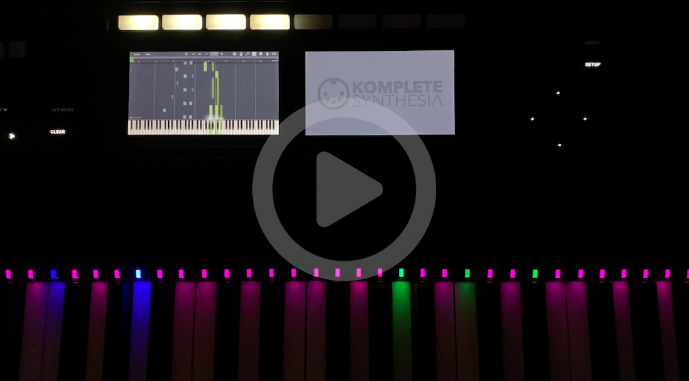
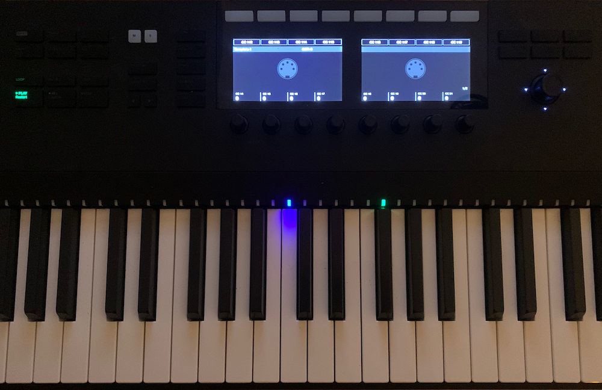
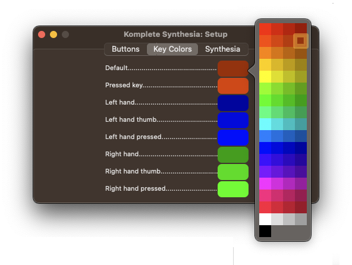
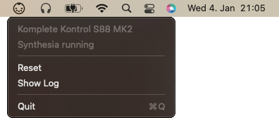

Native Instruments Komplete Kontrol Light Guide and Screen Mirroring Support for Synthesia.

## Features

Routes Synthesia lighting information to your Native Instruments keyboard controller USB device. Mirrors the Synthesia application window onto your Komplete Kontrol MK2 displays.

Auto-detects a Native Instruments S-series keyboard controller USB device. Listens on the 'LoopBe' MIDI input interface port. Notes received are forwarded to the keyboard controller USB device as key lighting requests adhering to the Synthesia protocol.

Additionally supports jogwheel and the 'Play' button for starting and stopping a session in Synthesia.

Chose your favorite lightguide colors or work with the defaults.

## Setup

You first need to configure your system and Synthesia to support our way of routing the lighting information to KompleteSynthesia. Please follow [SETUP.md](SETUP.md).

## Use

Simply run `KompleteSynthesia.app`. First thing you will have to permit a bunch of rather intrusive application capabilities.

When running it the first time, the first thing you will be asked by your system is:

- Allow for 'Input Monitoring'
    - this is needed for receiving button events from the Komplete Kontrol controller

- Allow for 'Screen Recording'
    - this is needed for mirroring the Synthesia application window onto the Komplete Kontrol LCD screens

Then, when pushing the 'Play' button or using the jogwheel, the system will ask you for:

- Allow for 'Accessibility'
    - this is needed for sending out virtual keyboard events to your system, recognized by Synthesia

Komplete Synthesia will detect your controller and show a little rainbow swoosh on the keyboard lights, signalling that it is up and running. The 'Play' button should be illuminated now just like the jogwheel. You will also recognise a little MIDI cable icon on the top right of your screen.

For finding out about the detected controller, click on the icon which will show a menu which contains its name. The displayed menu will additionally tell you if Synthesia was detected running.

## Problems

- No Native Instruments keyboard controller detected
    - Komplete Synthesia currently supports the Komplete Kontrol S-series
    - Make sure the keyboard is connected and powered on
  
- MIDI interface port 'LoopBe' not found
    - Make sure you followed the [Setup](#setup) documentation on [Creating the virtual MIDI interface](SETUP.md#creating-the-virtual-midi-interface)

- Button background lighting changes when pushing Play or using the jogwheel
    - Known issue happening due to Native Instruments components interfereing
    
- Synthesia lighting only ever shows green keys (right hand), never blue (left hand)
    - Synthesia isn't setup the way we need it - we need "Finger-based channel" lighting
    - Make sure you followed the [Setup](#setup) documentation on [Configuring Synthesia](SETUP.md#configuring-synthesia)

- All Keyboard LEDs show blue lights
    - Did you possibly push the "Instance" button?
        - On macOS the NI component listening for controller button pushes does re-initialize the controller into a mode incompatible with KompleteSynthesia
    - Are you running any other NI applications while running KompleteSynthesia?
        - Some NI tools like KompleteKontrol.app do set the keyboard into something KompleteSynthesia just can not work with
        - Exit KompleteKontrol.app - you wont need it while using Synthesia
    - Use the "Reset" function in KompleteSynthesia drop-down menu

## Background and Motivation

The approach and implementation of Komplete Syntesia in its early inceptions was closely following a neat little Python project called [SynthesiaKontrol](https://github.com/ojacques/SynthesiaKontrol).
Kudos and many thanks to Olivier Jacques [@ojacques] for sharing!

The inspiration for re-implementing this as a native macOS appllication struck me when I had a bit of a hard time getting that original Python project to build on a recent system as it would not run on anything beyond Python 3.7 for me. Another driver here is that I always took great pleasure from controlling hardware via code. As a result no third party dependencies are made use of - pure, native macOS code that will compile without hassle in 10 years from now.
