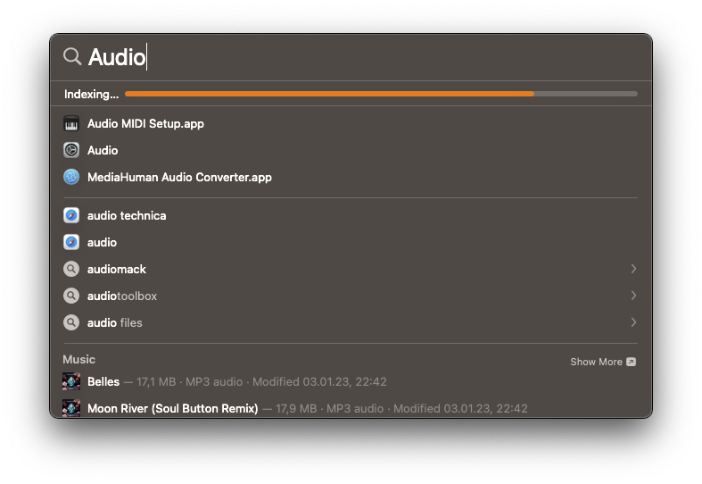
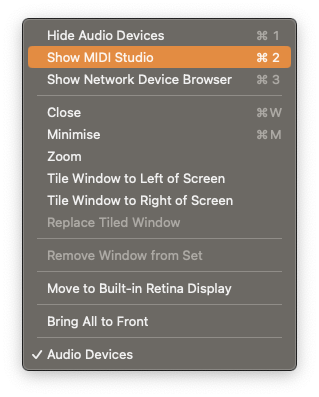
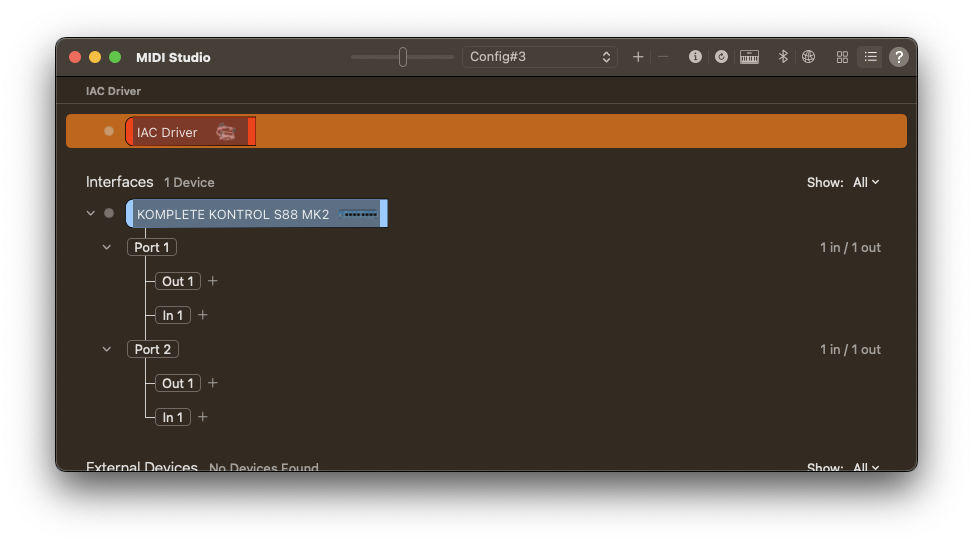
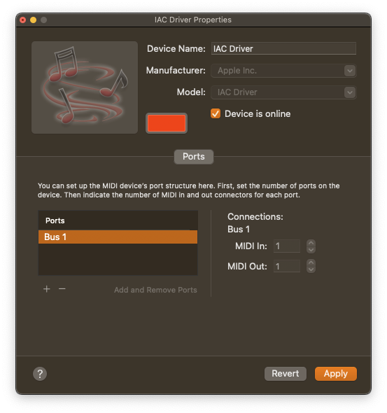
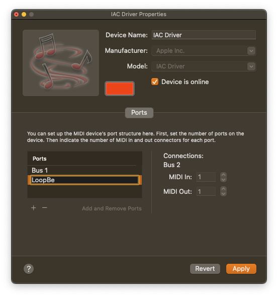
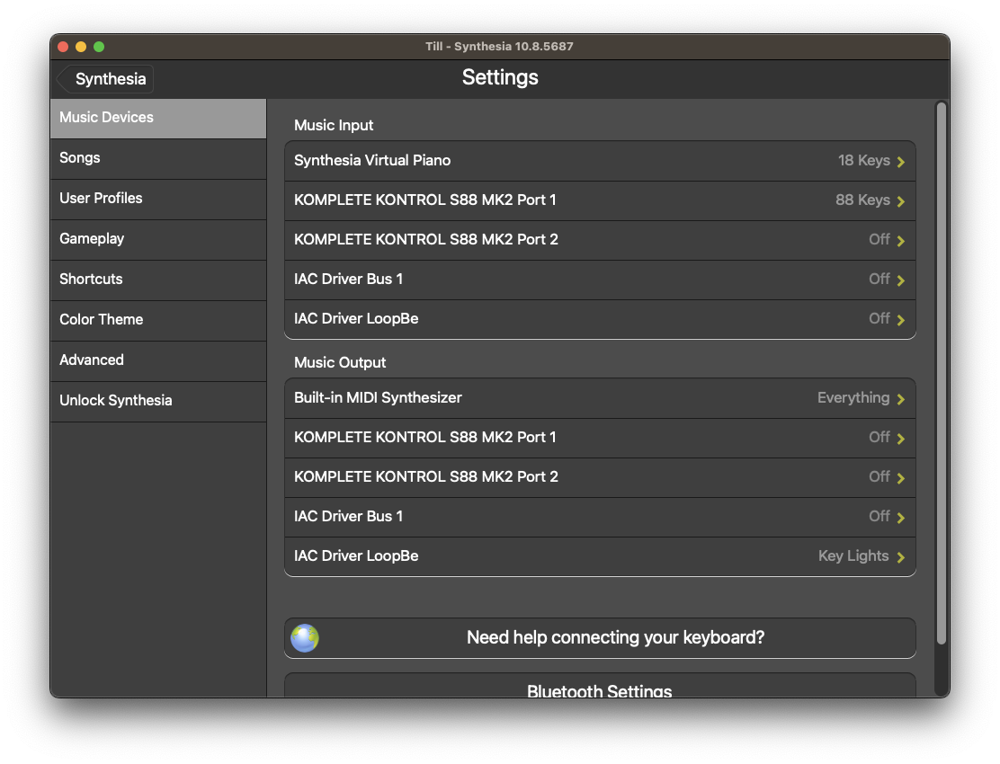
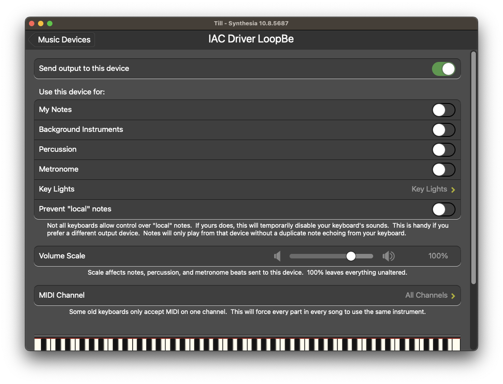
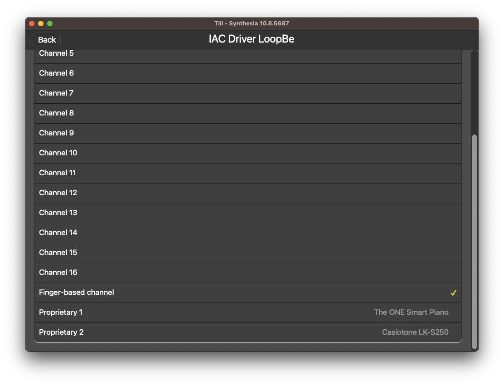

# Komplete Synthesia: Setup Guide

For looping back the MIDI lighting data from Synthesia into KompleteSynthesia, we need a virtual MIDI interface. 

## Creating the virtual MIDI interface

Run `Audio MIDI Setup.app`. For locating that helper, I commonly use quicksearch; `cmd+space` and enter `audio` or whatever fragment I remember.

Within the `Window` menu of the `Audio MIDI Setup.app`, select `Show MIDI Studio`.

And the following should appear;

Now double click on the `IAC Driver`. The following will show up;

Make sure the `Device is online` as seen above.

We now add a new, named port by clicking on that small `+` within the `Ports` section of that dialog. Name that new port `LoopBe`. There is no magic behind that name, KompleteSynthesia is simply hardcoded for that and SynthesiaKomplete used that name already. So why not remaining compatible with that solution.

Now click on `Apply`. We have now created a named port on the `IAC Driver` MIDI interface. We can now go ahead and configure Synthesia to make use of it.

## Configuring Synthesia

You have two options here, a semi automatic configuration by KompleteSynthesia, or manual configuration.

### Automated

For the automated variant, simply start KompleteSynthesia, it will help you patch the Synthesia configuration. If for some reason you need to repeat this automated configuration, use the "Settings" option from the application menu, then click on the "Synthesia"-tab.

### Manual

Open the `Settings` from within Synthesia. Both, Input and Output sections should now show the `IAC Driver LoopBe` port.

Now lets make sure that Synthesia sends the lighting information towards our new `LoopBe` port. To do that, click on `IAC Driver LoopBe` in the `Music Output` section. Then enable `Send output to this device` on the top. In the `Use this device for:` section, click on `Key Lights`.

Within the now opening list, scroll all the way down to `Finger-based channel` and activate that.

## Testing It

You are now ready for KompleteSynthesia. Run it!

Back to Synthesia, you can now run a test. Within settings menu of our `IAC Driver LoopBe`, there is an option to validate the setup. Click on `Test` on the bottom of this screen. Voila, you should now see the light-guide getting triggered by Synthesia.
